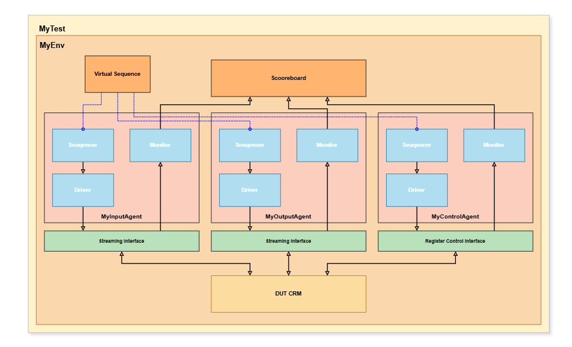

# Configurable Packet Modifier (CPM) – UVM Verification Environment

## Overview
This project implements a complete UVM 1.1d verification environment for a **Configurable Packet Modifier (CPM)** DUT.

The CPM is a streaming packet processor with register-controlled behavior.  
It supports mode-dependent payload transformations (PASS, XOR, ADD, ROT), opcode-based packet dropping, deterministic latency (0–2 cycles), and ready/valid backpressure.

The entire verification environment was architected and implemented from scratch.

---

## Environment Diagram



---

## Verification Architecture

The environment follows strict UVM methodology separation:

- Multi-agent architecture:
  - **Input Streaming Agent**
  - **Output Streaming Agent**
  - **Register Control Agent**
- Virtual Sequence orchestration (reset → configure → traffic → reconfigure → drop → readback)
- RAL-based register configuration (generated model + custom adapter)
- Transaction-level reference model & scoreboard
- Deterministic latency modeling
- Strict in-order checking
- Constrained-random stimulus

---

## Key Verification Components

### ✔ Reference Model
Implements mode-dependent transformation logic:
- PASS (0 cycles)
- XOR (1 cycle)
- ADD (2 cycles)
- ROT (1 cycle)

Configuration values are sampled at input acceptance time.

### ✔ Scoreboard
- Maintains expected transaction queue
- Handles drop logic
- Enforces strict ordering
- Compares expected vs actual outputs

### ✔ RAL Integration
- Generated register model
- Custom `uvm_reg_adapter`
- Configuration via RAL API (no direct bus access)

### ✔ Simulation Flow
- Automated compilation and run via Tcl DO scripts
- Batch & GUI modes supported
- Debug enabled via QuestaSim

---

## How to Run

From the `sim/` directory:

```bash
vsim -c -do run.do
