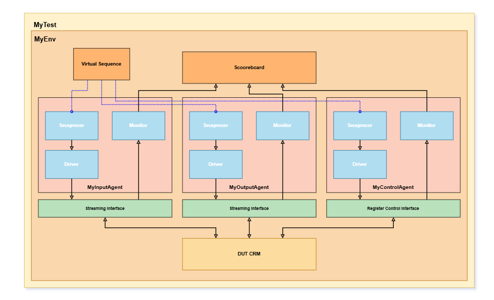

# Configurable Packet Modifier (CPM) – UVM Verification Environment

## Overview
This project implements a complete UVM 1.1d verification environment for a **Configurable Packet Modifier (CPM)** DUT.

The CPM is a streaming packet processor with register-controlled behavior.  
It supports mode-dependent payload transformations (PASS, XOR, ADD, ROT), opcode-based packet dropping, deterministic latency (0–2 cycles), and ready/valid backpressure.

The entire verification environment was architected and implemented from scratch.

---

## Environment Diagram



---

## Verification Architecture

The environment follows strict UVM methodology separation:

- Multi-agent architecture:
  - **Input Streaming Agent**
  - **Output Streaming Agent**
  - **Register Control Agent**
- Virtual Sequence orchestration (reset → configure → traffic → reconfigure → drop → readback)
- RAL-based register configuration (generated model + custom adapter)
- Transaction-level reference model & scoreboard
- Deterministic latency modeling
- Strict in-order checking
- Constrained-random stimulus

---

## Key Verification Components

### ✔ Reference Model
Implements mode-dependent transformation logic:
- PASS (0 cycles)
- XOR (1 cycle)
- ADD (2 cycles)
- ROT (1 cycle)

Configuration values are sampled at input acceptance time.

### ✔ Scoreboard
- Maintains expected transaction queue
- Handles drop logic
- Enforces strict ordering
- Compares expected vs actual outputs

### ✔ RAL Integration
- Generated register model
- Custom `uvm_reg_adapter`
- Configuration via RAL API (no direct bus access)

### ✔ Simulation Flow
- Automated compilation and run via Tcl DO scripts
- Batch & GUI modes supported
- Debug enabled via QuestaSim

---

---

## Functional Coverage Strategy

Functional coverage was implemented to measure verification completeness and ensure all packet-processing scenarios were exercised.

Coverage model includes:

• **Opcode Coverage**
  - PASS
  - XOR
  - ADD
  - ROT

• **Register Configuration Coverage**
  - Mode selection
  - Opcode drop configuration
  - Operation constants

• **Packet Processing Coverage**
  - Packet acceptance
  - Packet drop scenarios
  - Latency behavior across modes

• **Cross Coverage**
  - Opcode × Configuration mode
  - Opcode × Drop configuration
  - Packet type × Operation mode

Coverage was collected using SystemVerilog covergroups integrated into the verification environment.

---

## Regression Strategy

Regression testing was executed using constrained-random stimulus combined with directed test scenarios.

Test suite includes:

- **Smoke Tests** – basic functionality validation
- **Stress Tests** – high volume randomized traffic
- **Configuration Tests** – runtime register reconfiguration
- **Drop Tests** – validation of opcode drop logic
- **Readback Tests** – RAL register integrity

Each regression run generates thousands of packet transactions with randomized payloads, opcodes, and timing conditions.

---

## Coverage Results

Final regression runs achieved high functional coverage across all packet processing scenarios.

| Coverage Type | Result |
|---------------|-------|
| Functional Coverage | **>90%** |
| Opcode Coverage | **100%** |
| Register Configuration Coverage | **>90%** |
| Cross Coverage (Opcode × Mode) | **>85%** |

Coverage closure was achieved through iterative constrained-random regression and targeted tests to cover corner-case scenarios.

---

## Verification Achievements

• Architected a full **UVM verification environment from scratch**  
• Implemented **3 independent UVM agents** for streaming and register interfaces  
• Integrated **RAL-based register verification** using a generated register model  
• Developed **reference model and scoreboard** for transaction-level checking  
• Executed regressions generating **thousands of packet transactions**  
• Achieved **>90% functional coverage and coverage closure**

The resulting environment provides a **scalable and reusable verification infrastructure** suitable for regression-driven verification and future feature extensions.

## How to Run

From the `sim/` directory:

```bash
vsim -c -do run.do
